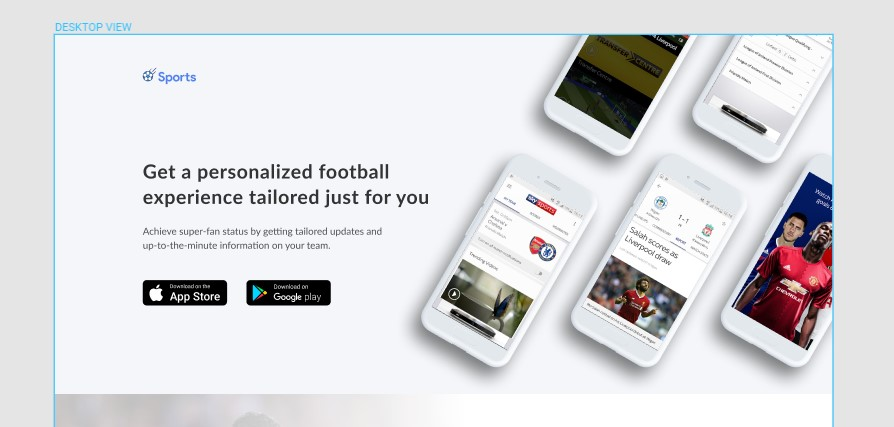

# frontend-junior-task
# Тестовое задание разработчика в 2Dit

Сверстать первый экран макета по[БЭМ](https://ru.bem.info/) (первый экран) по макету. Макет находится по [ссылке](https://www.figma.com/file/MxiIfk5djCxaroatwdhriDvg/Mobile-App-Landing-Page?node-id=1%3A1914). (Figma)

### Main Screen

## Требования к верстке
#### Оглавление
1. [Соответствие макету](#pixel-perfect)
2. [Кроссбраузерность, кодировка и DOCTYPE](#crossbrowser)
3. [Валидность](#valid)
4. [Корректная работа при вбивании реального текста, надёжность вёрстки](#reliability)
5. [Отсутствие глупостей в html и css, единообразие, аккуратность
Правильная структура заголовков (H1,H2,… и т.д. и TITLE)](#no-folly)
6. [Правильная структура заголовков](#seo)

### <a name="pixel-perfect">1. Соответствие макету</a>

* 1.1. Для проверки соответствия вашей верстки макету, необходимо использовать [Pixel Perfect](https://chrome.google.com/webstore/detail/perfectpixel-by-welldonec/dkaagdgjmgdmbnecmcefdhjekcoceebi?hl=ru). Суть работы плагина: дизайн макет страницы накладывается на вашу верстку в целях проверки соответствия вашей верстки макету.

* 1.2. Стремитесь к 100% соответствию с макетом.

* 1.3. При явных проблемах в дизайн макете (ошибках дизайнера) вы вправе придерживаться здравого смысла.

* 1.4. Допустимо, чтобы по ширине текст расходился с макетом (связано с межбуквенным интервалом. Не нужно пытаться менять межбуквенный интервал при помощи CSS).

* 1.5. При изменениях контента, размеры блоков могут меняться (по высоте, например).

### <a name="crossbowser">2. Кроссбраузерность, кодировка и DOCTYPE</a>

* 2.1. Кодировка: UTF-8. Зачем нужно: UTF-8 это универсальность и совместимость. Это современный стандарт, за ним даже не будущее, а настоящее. Эта кодировка должна использоваться для всех файлов: html, css, js (если файлы в разных кодировках почти наверняка будут проблемы).

* 2.2. DOCTYPE: HTML5. Зачем нужно: наличие корректного doctype необходимо чтоб страницы отображались в соответствии со стандартами. HTML5 doctype позволяет нам смело использовать современные тэги (canvas, header, article,...) и старые проверенные решения, ранее бывшие в опале (например embed). HTML5 — это современный стандарт, в нём можно писать и в строгом XHTML-синтаксисе. 

* 2.3. Кроссбраузерность:
  * Chrome (последний)
  * Firefox (последний)
  * Safari (последний)
  * Opera (последний)
  * IE11, EDGE (последний)

### <a name="valid">3. Валидность</a>

* 3.1. Все страницы должны быть валидны.
* 3.2. CSS валидируется по версии 3.0, его валидность не требуется. Достаточно чтобы не было синтаксических ошибок (например margin: 10xp).
* 3.3. Не должно быть js ошибок.

  #### Валидность проверяется онлайн валидаторами:
    - HTML: [validator.w3.org](http://validator.w3.org/) (или [Web Developer](https://chrome.google.com/webstore/detail/web-developer/bfbameneiokkgbdmiekhjnmfkcnldhhm) → Tools → Validate HTML)
    - CSS: [jigsaw.w3.org/css-validator](http://jigsaw.w3.org/css-validator/) (или [Web Developer](https://chrome.google.com/webstore/detail/web-developer/bfbameneiokkgbdmiekhjnmfkcnldhhm) → Tools  → Validate CSS)
    - Консоль:  не должно быть ошибок в консоли браузера.

### <a name="reliability">4. Надёжность вёрстки</a>

* 4.1. **Проверка ввода и удаления данных.** Проверяется: на странице с контентом, пробуем добавлять и удалять содержимое – «что будет когда текста много?», «а когда мало?».  Обязательно пробовать менять расположение элементов, чтоб после того как вы поменяли блоки местами не развалилось оформление (из-за каскада).
* 4.2. **Проверка корректности работы стилей.** Проверяется: на страницы с контентом вбиваем текст с абзацами и без абзацев (важно! бывает горе-верстальщики прописывают стили только для абзацев), со списками и картинками, таблицами и заголовками разных уровней.

*Вёрстка должна тянутся, не разваливаться и не терять дизайнерский вид при изменении контента на странице. Его может быть больше или меньше чем на макете, он может быть обёрнут во всякие `
` из wysiwyg и т.п.*

*Обязательно нужно проверять удаление заголовков! Бывает что отступы между блоками после этого схлопываются, это частая ошибка, причина — что отступы были заданы не для блоков, а для внутренних элементов — заголовков.*
*Это нужно чтоб на живом сайте потом не появились проблемы при заполнении реальными данными.*

*Хорошо использовать html5-тэги для разметки: header, footer, aside, nav, section, article и т.д. Кроме того что это семантично, также повышается надёжность, «пуленепробиваемость» вёрстки. Лишний открытый или закрытый div легко может поломать вёрстку. Но когда каркас сайта — атомарные и редко повторяющиеся html5-тэги, то «поломка» локализуется в пределах html5-тэга.*

### <a name="no-folly">5. Отсутствие глупостей в html и css, единообразие, аккуратность</a>
#### Плохо:
- Отступы между блоками на сайте должны быть за счёт margin у блоков, а не выпирающих наружу margin у содержимого блоков.
- Плохо — отсутствие alt у картинок.
- **Очень плохо** — презентационные классы (right, red).
- Нежелательно когда вёрстка содержит пустые блоки для презентационных целей, для этого существуют псевдоэлементы
- Плохо когда нет базовых стилей у стандартных элементов. Т.е. просто h1,h2,ul,table,etc без классов должны смотреться красиво и органично. Проще говоря — используйте Normalize, a не Reset CSS.
- **Плохо (недопустимо!)** вешать стили на селекторы вложенных стандартных тэгов, без классов. Т.е. писать что-то типа `h2 a span {}`.
- Плохо — напрямую задавать визуальное отображение элементов через js: `$('.element').css('color','#f00')`. Это должно делаться через установку/смену классов.

#### Хорошо:
- По возмжоности использовать БЭМ! Важно понимать что это методология, а не инструменты. Нужно обязательно уходить от каскада, а БЭМ — это один из отличных вариантов решения.
- Хорошо — структурировать код в блоки описывающие логику документа. Т.е. создавать div даже там, где он для презентационных целей не нужен. И наоборот — стараться не ставить лишний div там, где структура этого не требует, а это нужно лишь для визуальных эффектов.

### <a name="seo">6. Правильная структура заголовков</a>
- Это забота о семантичности кода, заголовки структурируют сайт, делают его корректным документом. Корректный Document Outline важен для SEO.

- Проверяется через плагин [Web Developer](https://chrome.google.com/webstore/detail/web-developer/bfbameneiokkgbdmiekhjnmfkcnldhhm) → Information → View Document Outline. Красных строк быть не должно!

### Важно!
- Все ссылки должны как-то реагировать на `:hover`, `:active` и `:focus` — показыванием/убиранием подчёркивания, сменой цвета, чем угодно.
- Проверить, что все интерактивные элементы страницы, что должны работать — работают.
- В вёрстке не должны оставаться закомментированные «на всякий случай» куски кода, лишние неиспользуемые файлы, старые версии файлов и т.п. Все бекапы можно вытянуть из системы контроля версий (например Git или SVN), а на живом проекте «мусор» потом мешает разобраться как что работает.
- Ресайз textarea не должен ломать вёрстку
- Разумеется картинки должны быть в отдельной папке, css — в отдельной и js — в отдельной.

### Responsive
Страница не должна ломаться на разных разрешениях экрана.

## Общие рекомендации
Если используете инструменты для ускорения разработки(препроцессоры, шаблонизаторы, таск-раннеры), для проверки лучше предоставить все исходники.

Луше отправить законченную работу и не уложиться в срок, чем уложиться и прислать неготовую страницу. Однако в таком случае в сопроводительном письме следует указать причину задержки.

**Не допускается использование CSS-фрейморков(bootstrap, foundation, etc.)**

Допускается использование jQuery или других js-библиотек.

Работу лучше присылать ссылкой на [GitHub](https://github.com/)([GitLab](https://gitlab.com/)/[Bitbucket](https://bitbucket.org/)).

## Если есть вопросы по тестовому можно писать [Дмитрию](mailto:dm@2dit.ru)

